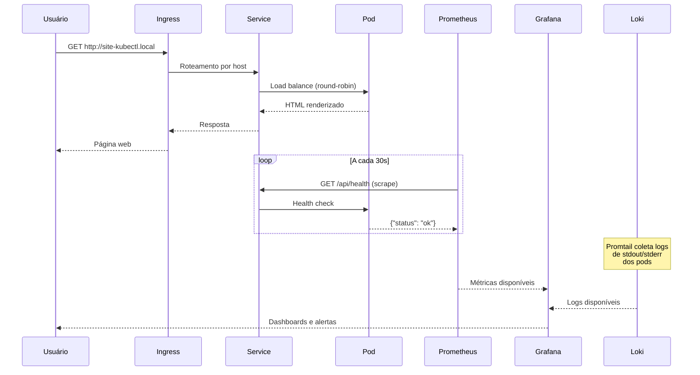

# Diagrama de Arquitetura — ReliabilityLab

## Diagrama Geral (formato Mermaid)

Para renderizar este diagrama, utilize o [Mermaid Live Editor](https://mermaid.live) ou
qualquer extensão Mermaid no VS Code.

```mermaid
graph TB
    subgraph Internet["Máquina Local"]
        Browser["🌐 Navegador<br/>site-kubectl.local"]
    end

    subgraph Cluster["Cluster Kubernetes Local (kind/k3d/minikube)"]

        subgraph IngressNS["namespace: ingress-nginx"]
            Ingress["NGINX Ingress<br/>Controller"]
        end

        subgraph AppNS["namespace: reliabilitylab"]
            SVC["Service<br/>ClusterIP :80"]
            Pod1["Pod site-kubectl<br/>réplica 1 :8000"]
            Pod2["Pod site-kubectl<br/>réplica 2 :8000"]
            HPA["HPA<br/>2-6 réplicas<br/>CPU 70%"]
            NP["NetworkPolicy<br/>zero-trust"]
            PDB["PDB<br/>minAvailable=1"]
            CM["ConfigMap"]
            SEC["Secret"]
        end

        subgraph MonNS["namespace: monitoring"]
            Prom["Prometheus"]
            Graf["Grafana<br/>:3000"]
            Loki["Loki"]
            Promtail["Promtail<br/>(DaemonSet)"]
            OTel["OTel<br/>Collector"]
        end

        subgraph ArgoNS["namespace: argocd"]
            Argo["ArgoCD<br/>Server"]
        end

        subgraph SLONS["SLO Monitoring"]
            AlertRules["PrometheusRule<br/>SLO Burn Rate<br/>Error Rate<br/>Latência"]
            AlertMgr["Alertmanager<br/>Routing<br/>Grouping"]
            WebhookLog["Webhook Logger<br/>Receiver Local"]
            SLODash["Grafana SLO<br/>Dashboard"]
        end

        subgraph ChaosNS["Chaos Engineering"]
            PodDel["Pod Delete<br/>Job"]
            CPUStress["CPU Stress<br/>Job"]
            MemStress["Memory Stress<br/>Job"]
            NetLat["Network Latency<br/>Job"]
            TotalKill["Total Pod Kill<br/>Cenário Outage"]
            NetPart["Network Partition<br/>Cenário Outage"]
            ResExhaust["Resource Exhaustion<br/>Cenário Outage"]
        end

        subgraph LoadNS["Load Testing"]
            K6["k6<br/>smoke | load<br/>stress | spike"]
            K6Res["k6 Resilience<br/>carga + chaos"]
        end

        subgraph ResilienceNS["Pipeline de Resiliência"]
            Pipeline["run-resilience-tests.sh<br/>deploy → load →<br/>chaos → observe →<br/>validate SLOs"]
        end

        subgraph SecNS["Security"]
            RBAC["RBAC<br/>viewer/deployer"]
            PSS["Pod Security<br/>Standards"]
        end
    end

    subgraph Git["GitHub"]
        Repo["Jh0wSSilva/<br/>reliabilitylab"]
    end

    Browser -->|HTTP| Ingress
    Ingress -->|rota /| SVC
    SVC --> Pod1
    SVC --> Pod2
    HPA -.->|escala| Pod1
    HPA -.->|escala| Pod2
    CM -.->|env vars| Pod1
    CM -.->|env vars| Pod2
    SEC -.->|secrets| Pod1
    SEC -.->|secrets| Pod2
    NP -.->|filtra tráfego| Pod1
    NP -.->|filtra tráfego| Pod2

    Prom -->|scrape /api/health| SVC
    Promtail -->|coleta logs| Pod1
    Promtail -->|coleta logs| Pod2
    Promtail -->|envia| Loki
    OTel -->|métricas| Prom
    OTel -->|logs| Loki
    Prom -->|datasource| Graf
    Loki -->|datasource| Graf

    Argo -->|sync| Repo
    Argo -->|apply| AppNS

    Prom -->|dispara alertas| AlertRules
    AlertRules -->|envia| AlertMgr
    AlertMgr -->|notifica| WebhookLog
    Prom -->|SLO metrics| SLODash
    SLODash -.->|burn rate<br/>error budget| Graf

    PodDel -.->|deleta pod| Pod1
    CPUStress -.->|consome CPU| AppNS
    MemStress -.->|consome memória| AppNS
    TotalKill -.->|kill all pods| AppNS
    NetPart -.->|bloqueia rede| AppNS
    ResExhaust -.->|satura recursos| AppNS

    K6 -->|HTTP requests| Ingress
    K6Res -->|carga + chaos| Ingress
    Pipeline -->|orquestra| K6Res
    Pipeline -->|orquestra| ChaosNS
    Pipeline -->|valida| Prom

    RBAC -.->|controla acesso| AppNS
    PSS -.->|restringe pods| AppNS
```

## Diagrama de Fluxo de Dados

## Descrição das Camadas

### Camada de Acesso
- Navegador → Ingress Controller → Service → Pods
- Host: `site-kubectl.local` mapeado no `/etc/hosts`

### Camada de Aplicação
- 2 a 6 réplicas (gerenciado pelo HPA)
- FastAPI + Uvicorn na porta 8000
- ConfigMap + Secret injetados como variáveis de ambiente

### Camada de Confiabilidade
- readinessProbe + livenessProbe + startupProbe
- PodDisruptionBudget (min 1 pod disponível)
- HorizontalPodAutoscaler (CPU 70%, memória 80%)
- RollingUpdate (zero downtime)

### Camada de Segurança
- Container não-root (UID 10001)
- Capabilities dropadas (ALL)
- NetworkPolicy: apenas Ingress e Prometheus podem acessar

### Camada de Observabilidade
- Prometheus: métricas de infraestrutura e aplicação
- Grafana: dashboards e alertas visuais
- Loki + Promtail: logs centralizados
- OpenTelemetry: traces distribuídos

### Camada GitOps
- ArgoCD monitora branch `main`
- Auto-sync + self-heal ativados
- Toda mudança passa por Git
